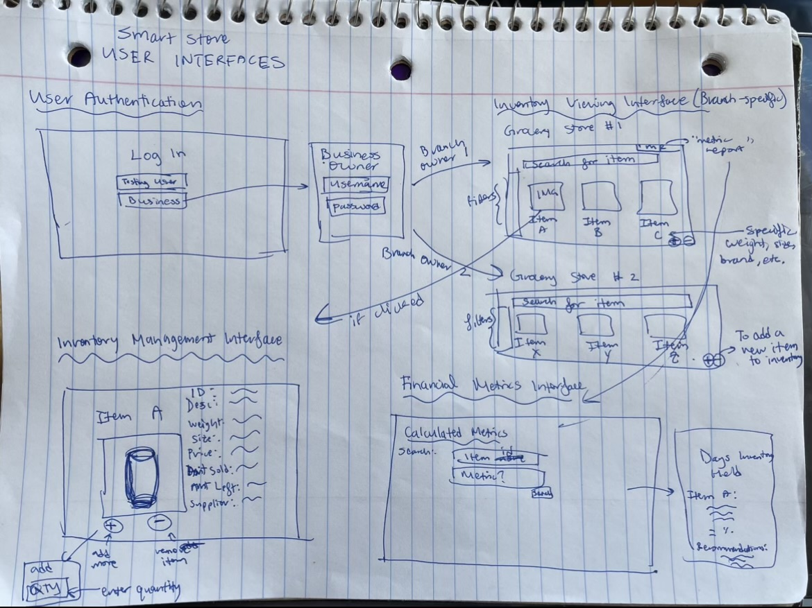
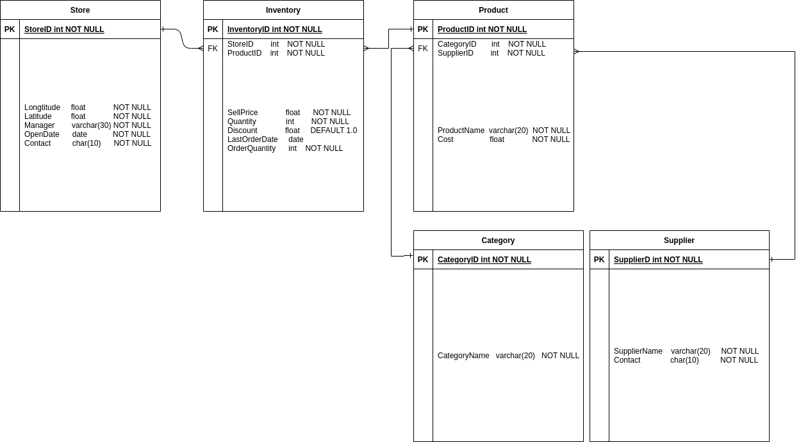

# Requirements and Specification Document

## Team_03: Chipmunk

<!--The name of your team.-->

### Project Abstract

<!--A one paragraph summary of what the software will do.-->

## Smart Stock

Smart Stock is a comprehensive solution designed to streamline inventory management processes in a grocery store setting. Leveraging **Java (Spring)** for the backend, **React JS** for the frontend, and **MySQL** for data storage, the system allows business owners to efficiently track and manage individual items in their inventory. The frontend interface offers both customer-facing and business owner-focused functionalities, enabling seamless interaction with inventory counts and adjustments. Through backend functions triggered by frontend actions, the system facilitates real-time updates to inventory levels in the database, ensuring accurate and up-to-date information on product availability. With features such as **item categorization**, **brand management**, **size tracking**, and **location mapping**, **coupled with robust querying capabilities**, the system empowers grocery store owners to optimize stock levels, enhance customer satisfaction, and drive operational efficiency.

<!-- This is an example paragraph written in markdown. You can use *italics*, **bold**, and other formatting options. You can also <u>use inline html</u> to format your text. The example sections included in this document are not necessarily all the sections you will want, and it is possible that you won't use all the one's provided. It is your responsibility to create a document that adequately conveys all the information about your project specifications and requirements.
 -->
<!-- Please view this file's source to see `comments` with guidance on how you might use the different sections of this document.  -->

### Customer

<!--A brief description of the customer for this software, both in general (the population who might eventually use such a system) and specifically for this document (the customer(s) who informed this document). Every project will have a customer from the CS506 instructional staff. Requirements should not be derived simply from discussion among team members. Ideally your customer should not only talk to you about requirements but also be excited later in the semester to use the system.-->

The primary customer for this software is a grocery store owner or manager seeking to streamline inventory management processes within their store. This customer is likely to be tech-savvy enough to navigate and utilize a digital interface but may not have extensive technical expertise. They value efficiency, accuracy, and organization in their inventory tracking efforts and are looking for a user-friendly solution that integrates seamlessly into their existing operations. Additionally, they may prioritize features such as real-time inventory updates, intuitive interface design, and the ability to access inventory data remotely for informed decision-making. Overall, this customer seeks to leverage technology to optimize inventory control and enhance the overall efficiency of their grocery store management.


### User Requirements

<!--This section lists the behavior that the users see. This information needs to be presented in a logical, organized fashion. It is most helpful if this section is organized in outline form: a bullet list of major topics (e.g., one for each kind of user, or each major piece of system functionality) each with some number of subtopics.-->

<!-- 
Here is a user requirements sample from [Crookshanks](https://learning-oreilly-com.ezproxy.library.wisc.edu/library/view/practical-software-development/9781484206201/9781484206218_Ch02.xhtml): -->

<!-- | ID   | Description                                                  | Priority | Status |
| ---- | ------------------------------------------------------------ | -------- | ------ |
| R11  | Users should not have to sign into the system; their current network login should be used for identification. | Med      | Done   |
| R12  | The user should pick a project first; the tasks available are a derivative of the project. | High     | Open   |
| R13  | A full-time employee should not be able to submit a time card with less than 40 hours per week recorded. | High     | Open   |
| R14  | A contractor can submit any number of hours up to 60 without special approval. | Med      | Open   |
| R15  | A team lead can see his/her team's time cards before they are submitted but cannot approve them until the user submits it. | High     | Open   | -->

| ID   | Description                                                  | Priority | Status |
| ---- | ------------------------------------------------------------ | -------- | ------ |
| R1  | The system shall allow users to sign in, distinguishing between corporate  users and individual chain business owners, with separate login pages provided for each user type.  | Med      | Open   |
| R2  | The system shall enable Grocery Store Managing Users to select specific inventory items for observation. | High     | Closed   |
| R3  | The system shall permit Grocery Store Managing Users to add or remove items from the inventory for each product. | High     | Open   |
| R4  | The system shall restrict Grocery Store Managing Users to view only the inventory of the branch they are assigned to manage. | High      | Open   |
| R5  | Upon request, the system shall generate and provide financial metrics (such as Days Inventory Held) for the inventory managed by the Grocery Store Managing User.  | Med     | Open   |
| R6  | System shall allow users to search up a product by Name, Category, Supplier   | High     | Closed   |

<!-- <div align="center"><small><i>Excerpt from Crookshanks Table 2-2 showing example user requirements for a timekeeping system</i></small></div>

- You 
  - Can
    - Use
- Bullet
  - Points
    - In
    - Markdown -->

### Use Cases & User Stories

<!--Use cases and user stories that support the user requirements in the previous section. The use cases should be based off user stories. Every major scenario should be represented by a use case, and every use case should say something not already illustrated by the other use cases. Diagrams (such as sequence charts) are encouraged. Ask the customer what are the most important use cases to implement by the deadline. You can have a total ordering, or mark use cases with “must have,” “useful,” or “optional.” For each use case you may list one or more concrete acceptance tests (concrete scenarios that the customer will try to see if the use case is implemented).-->

<!-- Here is a sample user story from [Clean Agile](https://learning-oreilly-com.ezproxy.library.wisc.edu/library/view/clean-agile-back/9780135782002/ch03.xhtml#ch03lev1sec1) using a markdown block quote: -->

<!-- > As the driver of a car, in order to increase my velocity, I will press my foot harder on the accelerator pedal.
 -->
1. User Case 1: User Authentication
    1. As a user, I want to be able to sign in to the Smart Stock system based on my role, so that I can access the appropriate features and functionalities.
        1. The system should provide separate login options for testing users and business owners.
        2. Upon successful authentication, the user should be redirected to the corresponding dashboard based on their role.
        
2. User Case 2: View Inventory
    1. As a grocery store managing user, I want to be able to select and view the inventory of my store, so that I can monitor stock levels and make informed decisions.
        1. The system should present a list of inventory items available in the store.
        2. The business user should be able to check the detail of a inventory.
        3. The business user should be able to filter and search for specific items based on categories, brands, or other parameters.

3. User Case 3: Manage Inventory
    1. As a grocery store managing user, I want to be able to add or remove items from the inventory, so that I can update stock levels as needed
        1. The system should provide options to add new items to the inventory and specify details such as quantity, category, and brand.
        2. The user should be able to remove items from the inventory and adjust quantities accordingly.

4. User Case 4: View Branch Inventory
    1. As a grocery store managing user, I want to only see the inventory of the branch that I am in charge of, so that I can focus on managing the stock for my specific location.
        1. The system should display inventory data only for the branch associated with the logged-in user.
        2. Access to inventory data from other branches should be restricted based on user permissions.

5. User Case: Generated Financial Metrics
    1. As a grocery store managing user, I want the system to provide financial metrics (such as Days Inventory Held) for the inventory that I oversee, so that I can analyze performance and optimize operations.
        1. The system should calculate and present financial metrics based on inventory data for the user's branch.
        2. The user should be able to request specific financial metrics and view them in a clear and accessible format.

6. User Case: Searching For Inventory
    1. As a grocery store employee or manager, I want to be able to search up the inventory that I want to access by product name, supplier, category, or their matching IDs.
        1. The system should have an panel that allows users to select what logic they want to search by.
        2. The system should have a real time search bar that filters out the invetories table with each key stroke.

### User Interface Requirements

<!--Describes any customer user interface requirements including graphical user interface requirements as well as data exchange format requirements. This also should include necessary reporting and other forms of human readable input and output. This should focus on how the feature or product and user interact to create the desired workflow. Describing your intended interface as “easy” or “intuitive” will get you nowhere unless it is accompanied by details.-->

<!--NOTE: Please include illustrations or screenshots of what your user interface would look like -- even if they’re rough -- and interleave it with your description.-->

<!-- Images can be included with `` -->



**User Authentication Interface**

The login interface should provide separate options for testing users and business owners.
It should include input fields for username and password.
Upon successful authentication, the user should be redirected to the appropriate dashboard based on their role.

**Inventory Viewing Interface**

The inventory viewing interface should present a clear and organized list of inventory items.
It should include filtering and search functionalities to allow users to find specific items based on categories, brands, or other parameters.
The interface should display relevant details for each inventory item, the quantity, category, and brand.
Branch Specific:
It should clearly indicate the branch name and location.
Access to inventory data from other branches should be restricted based on user permissions.

**Inventory Management Interface**

The inventory management interface should provide options for adding and removing items from the inventory.
It should include input fields and dropdown menus to specify details: the quantity, category, and brand, when adding new items.
The interface should include intuitive controls for adjusting quantities and removing items from the inventory.

**Financial Metrics Interface**

The financial metrics interface should present calculated metrics such as Days Inventory Held in a clear and accessible format.
It should allow users to request specific financial metrics and view them on-demand.
The interface should include interactive charts or graphs to visualize financial performance over time.

### Security Requirements

<!--Discuss what security requirements are necessary and why. Are there privacy or confidentiality issues? Is your system vulnerable to denial-of-service attacks?-->
For the Smart Stock business user, security is crucial for ensuring the integrity, confidentiality, and the availability of the inventory management system.

**Authentication and Authorization**

Requirement: Implement secure user authentication mechanisms, such as password-based authentication or multi-factor authentication, to verify the identity of users accessing the system.

Explanation: Proper authentication ensures that only authorized users can access sensitive inventory data and perform actions within the system. Authorization mechanisms should also be in place to control access levels based on user roles and permissions.

**Data Encryption**

Requirement: Encrypt sensitive data, such as user credentials, inventory information, and financial metrics, during transmission and storage using strong encryption algorithms.

Explanation: Encryption helps protect data from unauthorized access or interception by encrypting it into unreadable ciphertext. This ensures that even if data is compromised, it remains secure and confidential.

**Secure Communication**

Requirement: Implement secure communication protocols, such as HTTPS, to encrypt data transmitted between the frontend and backend components of the system.

Explanation: Secure communication can be achieved by encrypting data exchanged between the client and server. This safeguards sensitive information, such as login credentials and inventory details, during transit.

**Access Control**

Requirement: Enforce strict access controls and least privilege principles to limit user access to only the functionalities and data necessary for their roles.

Explanation: Access control mechanisms prevent unauthorized users from accessing or modifying sensitive inventory data. By restricting access based on user roles and permissions, for example, the separate paths created for various branch owners and test users, we can ensure that the user's access is limited.

**External Database**

Requirement: All customer and store data must be stored on MySQL database. Nothing should be kept locally to prevent data leakage attacks.

Explanation: All data queried about a specific branch's metrics and inventory is stored externally on a MySQL database that can only be accessed through the user's successful login. 

### System Requirements

<!--List here all of the external entities, other than users, on which your system will depend. For example, if your system inter-operates with sendmail, or if you will depend on Apache for the web server, or if you must target both Unix and Windows, list those requirements here. List also memory requirements, performance/speed requirements, data capacity requirements, if applicable.-->

| External Dependencies    |    Memory Requirements    |    Data Capacity |  Performance Requirements |
| ------ | :-------: | :-------: | ------: |
| Java |    Server Memory    | Inventory Data | Response Time |
| Spring    | Client Memory |    User Data     | Concurrency |
| React   |        |               | Scalability |

### Specification

<!--A detailed specification of the system. UML, or other diagrams, such as finite automata, or other appropriate specification formalisms, are encouraged over natural language.-->

<!--Include sections, for example, illustrating the database architecture (with, for example, an ERD).-->

<!--Included below are some sample diagrams, including some example tech stack diagrams.-->

<!-- You can make headings at different levels by writing `# Heading` with the number of `#` corresponding to the heading level (e.g. `## h2`).
 -->
#### Technology Stack


```flowchart RL
subgraph Front End
    A(React)
end
    
subgraph Back End
    B(Java: SpringBoot)
end
    
subgraph Database
    C[(MySQL)]
end

A <-->|HTTP| B
B <--> |SpringBoot| C


#### Database 
```Smart Stock
---
title: Databse ERD for Smart Stock
---
```


#### Class Diagram
<!-- 
```mermaid
---
title: Sample Class Diagram for Animal Program
---
classDiagram
    class Animal {
        - String name
        + Animal(String name)
        + void setName(String name)
        + String getName()
        + void makeSound()
    }
    class Dog {
        + Dog(String name)
        + void makeSound()
    }
    class Cat {
        + Cat(String name)
        + void makeSound()
    }
    class Bird {
        + Bird(String name)
        + void makeSound()
    }
    Animal <|-- Dog
    Animal <|-- Cat
    Animal <|-- Bird
``` -->


```Smart Stock
---
title: Grocery Store Inventory Management System Class Diagram
---

classDiagram
    class Store {
        - int storeId 
        - String storeBranchName
        - String storeLocation
        - String storeOwner
        + Store(int storeId, String storeBranchName, String storeLocation, String storeOwner)
        + int getStoreId()
        + void setStoreId(int storeId)
        + String getStoreBranchName()
        + void setStoreBranchName(String storeBranchName)
        + String getStoreLocation()
        + void setStoreLocation(String storeLocation)
        + String getStoreOwner()
        + void setStoreOwner(String storeOwner)
    }

    class Category {
        - int categoryId 
        - String categoryName
        + Category(int categoryId, String categoryName)
        + int getCategoryId()
        + void setCategoryId(int categoryId)
        + String getCategoryName()
        + void setCategoryName(String categoryName)
    }

    class Brand {
        - int brandId 
        - String brandName
        + Brand(int brandId, String brandName)
        + int getBrandId()
        + void setBrandId(int brandId)
        + String getBrandName()
        + void setBrandName(String brandName)
    }

    class Supplier {
        - int supplierId 
        - String supplierName
        + Supplier(int supplierId, String supplierName)
        + int getSupplierId()
        + void setSupplierId(int supplierId)
        + String getSupplierName()
        + void setSupplierName(String supplierName)
    }

    class Product {
        - int productId
        - String description
        - int storeId 
        - int categoryId 
        - int supplierId
        - int brandId
        - double price
        - double cost
        - int amountSold
        - int stockQty
        - double weight
        - double volume
        - Date created
        - Date lastUpdated
        - String status
        - String promotions
        - String additionalInformation
        + Product(int productId, String description, int storeId, int categoryId, int supplierId, int brandId, double price, double cost, int amountSold, int stockQty, double weight, double volume, Date created, Date lastUpdated, String status, String promotions, String additionalInformation)
        + int getProductId()
        + void setProductId(int productId)
        + String getDescription()
        + void setDescription(String description)
        + int getStoreId()
        + void setStoreId(int storeId)
        + int getCategoryId()
        + void setCategoryId(int categoryId)
        + int getSupplierId()
        + void setSupplierId(int supplierId)
        + int getBrandId()
        + void setBrandId(int brandId)
        + double getPrice()
        + void setPrice(double price)
        + double getCost()
        + void setCost(double cost)
        + int getAmountSold()
        + void setAmountSold(int amountSold)
        + int getStockQty()
        + void setStockQty(int stockQty)
        + double getWeight()
        + void setWeight(double weight)
        + double getVolume()
        + void setVolume(double volume)
        + Date getCreated()
        + void setCreated(Date created)
        + Date getLastUpdated()
        + void setLastUpdated(Date lastUpdated)
        + String getStatus()
        + void setStatus(String status)
        + String getPromotions()
        + void setPromotions(String promotions)
        + String getAdditionalInformation()
        + void setAdditionalInformation(String additionalInformation)
    }

```

#### Flowchart

```Smart Stock
---
title: Grocery Store Inventory Management System Flowchart
---
graph TD;
    Start([Start]) --> Input_Product_Data[/Input Product Data/];
    Input_Product_Data --> Validate_Product_Data{Validate Product Data};
    Validate_Product_Data -->|Valid| Process_Product_Data[Process Product Data];
    Validate_Product_Data -->|Invalid| Error_Product_Message[/Error: Invalid Product Data/];
    Process_Product_Data --> Update_Inventory[Update Inventory];
    Update_Inventory --> Display_Success_Message[/Success: Inventory Updated/];
    Display_Success_Message --> Select_Next_Action[/Select Next Action/];
    Error_Product_Message --> Select_Next_Action;
    Select_Next_Action --> Add_Product_Option[/Add New Product/];
    Select_Next_Action --> Remove_Product_Option[/Remove Existing Product/];
    Add_Product_Option --> Input_New_Product_Data[/Input New Product Data/];
    Input_New_Product_Data --> Validate_New_Product_Data{Validate New Product Data};
    Validate_New_Product_Data -->|Valid| Process_New_Product_Data[Process New Product Data];
    Validate_New_Product_Data -->|Invalid| Error_New_Product_Message[/Error: Invalid New Product Data/];
    Process_New_Product_Data --> Update_Inventory;
    Process_New_Product_Data --> Display_Success_Message;
    Error_New_Product_Message --> Select_Next_Action;
    Remove_Product_Option --> Select_Product_to_Remove[/Select Product to Remove/];
    Select_Product_to_Remove --> Confirm_Removal_Option[/Confirm Removal/];
    Confirm_Removal_Option --> Remove_Product;
    Remove_Product --> Update_Inventory;
    Remove_Product --> Display_Success_Message;
    Display_Success_Message --> Select_Next_Action;
```

#### Behavior
```Smart Stock
---
title: Grocery Store Inventory Management System State Diagram
---

stateDiagram
    [*] --> LoggedOut: User Not Logged In
    LoggedOut --> LoggedIn: User Logs In
    LoggedIn --> MainMenu: User Authentication Successful
    MainMenu --> ViewInventory: User Selects View Inventory
    ViewInventory --> InventoryList: User Views Inventory
    InventoryList --> ViewDetails: User Selects Item for Details
    ViewDetails --> InventoryList: User Returns to Inventory List
    ViewInventory --> ManageInventory: User Selects Manage Inventory
    ManageInventory --> AddItem: User Adds New Item
    AddItem --> InventoryList: Item Successfully Added
    ManageInventory --> RemoveItem: User Removes Item
    RemoveItem --> InventoryList: Item Successfully Removed
    ViewInventory --> GenerateMetrics: User Selects Generate Metrics
    GenerateMetrics --> DisplayMetrics: System Displays Financial Metrics
    MainMenu --> Logout: User Logs Out
    Logout --> LoggedOut: User Successfully Logged Out
    
```
#### Sequence Diagram

```Smart Stock
sequenceDiagram

participant ReactFrontend
participant JavaSpringBackend
participant MySQLDatabase

ReactFrontend ->> JavaSpringBackend: HTTP Request (e.g., GET /api/data)
activate JavaSpringBackend

JavaSpringBackend ->> MySQLDatabase: Query (e.g., SELECT * FROM data_table)
activate MySQLDatabase

MySQLDatabase -->> JavaSpringBackend: Result Set
deactivate MySQLDatabase

JavaSpringBackend -->> ReactFrontend: JSON Response
deactivate JavaSpringBackend
```

### Standards & Conventions

<!--Here you can document your coding standards and conventions. This includes decisions about naming, style guides, etc.-->
